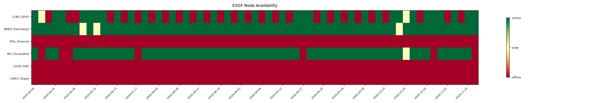

# ESGF Node Availability Status

_Last checked: 2026-11-14 UTC_

| Node | URL | Status | Response (ms) |
|------|-----|--------|---------------|
| LLNL (USA) | https://esgf-node.llnl.gov/thredds/catalog.html | 🟢 online | 505 |
| DKRZ (Germany) | https://esgf-data.dkrz.de/thredds/catalog.html | 🟢 online | 2961 |
| IPSL (France) | https://esgf-node.ipsl.upmc.fr/thredds/catalog.html | 🔴 offline | — |
| NCI (Australia) | https://esgf.nci.org.au/thredds/catalog.html | 🟢 online | 1136 |
| CEDA (UK) | https://esgf-index1.ceda.ac.uk/thredds/catalog.html | 🔴 offline | — |
| CMCC (Italy) | https://esgf-node.cmcc.it/thredds/catalog.html | 🔴 offline | 818 |

---

